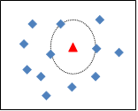
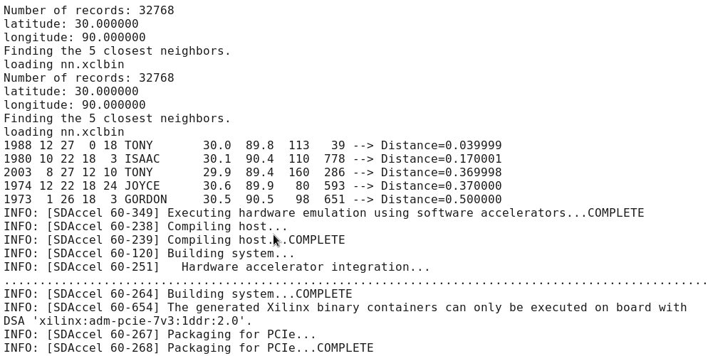

k-Nearest Neighbor algorithm
===============
## Overview:
This project deals with using SDAccel to implement the k-Nearest Neighbor algorithm onto a Xilinx FPGA. The nearest neighbor algorithm is used to find the _k_ nearest neighbors of a specified point among a set of unstructured data points. It is widely used in a diverse range of domains and applications such as pattern recognition, machine learning, computer vision and coding theory to name a few. For a set _S_ of _n_ reference data points in d-dimensional space and a query point _q_, k-nearest neighbor algorithm would find _k_ closest points in _S_ from the point _q_. This is illustrated in the accompanying figure for k=3 and n=12. The red triangle represents the query point while the blue diamonds represent the points in the reference data set in Figure 1.
 
<center></center>  
<center>Figure 1: Pictorial demonstration of KNN search algorithm</center>  

The algorithm can be classified into the following main steps:  
1.	Compute *n* distances between the query point *q* and the *n* reference points of the set *S*. The distances in our case are the squared Euclidean distances which for a given set of two 2-dimensional points _(x<sub>1</sub>,y<sub>1</sub>)_ and _(x<sub>2</sub>,y<sub>2</sub>)_ are given as follows:  
<center>_d = (x<sub>1</sub> - x<sub>2</sub>)<sup>2</sup> + (y<sub>1</sub> - y<sub>2</sub>)<sup>2</sup></center>_ 

2.	Sort the _n_ distances while preserving their original indices (as specified in _S_).  
3.	The _k_ nearest neighbors would be the _k_ points from the set _S_ corresponding to the lowest distances of the sorted distance array.  
	
## Getting Started:
The repository mainly contains three directories namely "data", "knn\_cpu" and "knn\_fpga". The "data" directory contains a file consisting of the reference data points. The "knn\_cpu" and "knn\_fpga" contains two different implementations of the KNN algorithm with nearest neighbors identification done on the CPU and FPGA respectively. Each implementation contains an OpenCL code of the algorithm along with the required host code and the Tcl script used to run the examples in SDAccel. 
   
###File Tree  
```
KNN  
│   README.md  
│
└── data  
│   └─  filelist.txt
│
└── knn_cpu
│   │   main_cpu.cpp 
│   │   nn_cpu.cl     
│   └─  solution_cpu.tcl
│
└── knn_fpga
    │   main_fpga.cpp
    │   nn_fpga.cl
    └─  solution_fpga.tcl
```  

**File/Dir name**  | **Information**  
-------------- | -----------------  
**knn\_cpu** | Contains "single kernel implementation" of the algorithm. The nearest neighbors identification in this implementation is done on the host.   
**knn\_fpga** | Contains "two kernels implementation" of the algorithm which uses a memory architecture optimization provided by SDAccel that implements the global memories used to communicate between the kernels on to the FPGA Block RAMs. The nearest neighbors identification in this case is done on the FPGA.  
**filelist.txt** | Contains the points of reference data set (32768 points!).  
**main\_cpu.cpp** | The host code for the implementation with nearest neighbors identification done on the host.  
**nn\_cpu.cl** | The kernel which calculates all the distances and write them to the host for nearest neighbors identification.  
**solution\_cpu.tcl**   | Script to implement the "host nearest neighbors estimation" case in SDAccel.    
**main\_fpga.cpp** | The host code for the "two kernels implementation" of the algorithm on the FPGA where, the distances are calculated in multiple work groups by one kernel and then the neighbors are estimated for a single work-group on another kernel.  
**nn\_fpga.cl** | The OpenCL code using global memory buffers to stream data between two kernels. One of the kernels calculates the distance between the query point and all the points in the reference data set. The second kernel identifies the nearest neighbors in a single work-group.  
**solution\_fpga.tcl** | Script to implement the "FPGA nearest neighbors identification" case of the algorithm using two kernels.    

### Parameters
The query point in terms of latitude and longitude and the number of nearest neighbors in all the cases can be specified by changing the corresponding values at the top of the host code.  
 
### How to run an example      
For compiling OpenCL codes onto Xilinx FPGAs, the following tool must be installed:  
> Xilinx SDAccel 2015.1  
    
In each sub-directory, there are script files to run the solutions for each test case. They can be used as follows:

>  sdaccel solution\_cpu.tcl  
>  sdaccel solution\_fpga.tcl  

The nearest neighbors along with the given query point, number of neighbors _k_ and the number of records i.e. the number of points in the reference data set, will be printed on the standard IO.

### Sample Output
The final output in all cases shall list the nearest neighbors among the points in the reference data set before indicating the successful building and packaging of the implementation for SDAccel compliant boards. The sample output after a successful run would look like:
<center></center>
<center>Figure 2: Sample Output after a successful run</center>  
    
## Performance Metrics
The performance metrics in each case are the following parameters:
> Initiation Interval: Indicating the number of clock cycles between two consecutive iterations of a loop    
> Latency: Indicating the number of clock cycles required to complete the execution of an implementation  

Both of the metrics have a profound effect on the execution time in case of an FPGA implementation and also effects the overall energy consumption over an FPGA.  

### Performance Comparison
The FPGA vs GPU performance comparison for the "knn\_cpu" and "knn\_fpga" implementations in terms of execution time, power and energy consumption is described here. It shall be noted that in the "knn\_cpu" case, the nearest neighbors identification time on the host i.e. the CPU has also been added to the execution time. The devices used for comparison are the following:  
- NVIDIA GeForce GTX 960 with 1024 cores  
- NVIDIA Quadro K4200 with 1344 cores  
- Xilinx Virtex 7 xc7vx690tffg1157-2  

**knn\_cpu**  

platform         |     time     | power(W)| energy(J)   
:--------------- | ------------:| -------:| ----------  
Virtex 7         |    0.587ms   |  0.412  |   0.000056  
GTX 960          |    0.528ms   |  120    |   0.00936  
K4200            |    0.603ms   |  108    |   0.0144 

Area Utilization |     Values     
:--------------- | ------------  
BRAMs            |      0   
DSPs             |      12 (0.33%)  
FFs              |      3141 (0.36%)   
LUTs             |      2042 (0.47%)  
 

**knn\_fpga**

platform         |     time     | power(W)| energy(J)   
:--------------- | ------------:| -------:| ----------  
Virtex 7         |    0.0044ms  |  3.027  |   0.000013  
GTX 960          |    0.331ms   |  120    |   0.0397    
K4200            |    0.451ms   |  108    |   0.0487  
  

Area Utilization |     Values     
:--------------- | ------------  
BRAMs            |      32 (2.18%)   
DSPs             |      12 (0.33%)  
FFs              |      24907 (2.90%)  
LUTs             |      12583 (2.93%) 
         
## More Information
 * [SDAccel User Guide](http://www.xilinx.com/support/documentation/sw_manuals/xilinx2015_1/ug1023-sdaccel-user-guide.pdf)
 * [k-Nearest Neighbor Algorithm](https://en.wikipedia.org/wiki/K-nearest_neighbors_algorithm) 
 * [The Khronos Group Inc.](https://www.khronos.org/registry/cl/sdk/1.1/docs/man/xhtml/)
 * [Vivado High Level Synthesis User Guide](http://www.xilinx.com/support/documentation/sw_manuals/xilinx2015_1/ug902-vivado-high-level-synthesis.pdf)
 * [Rodinia: A benchmark Suite for Heterogeneous Computing](http://ieeexplore.ieee.org/xpls/abs_all.jsp?arnumber=5306797)  
 


 


